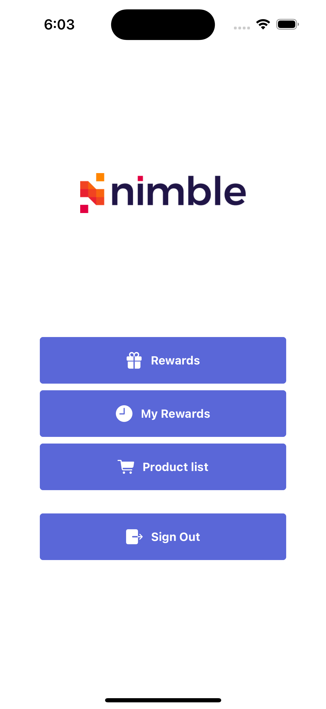
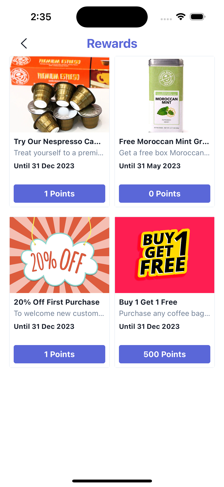
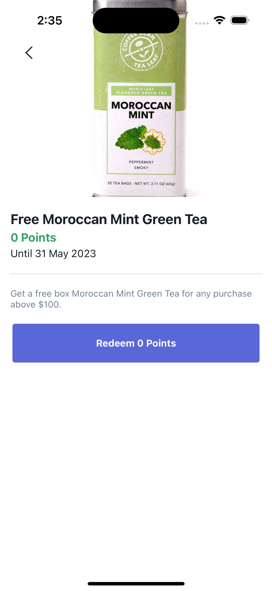
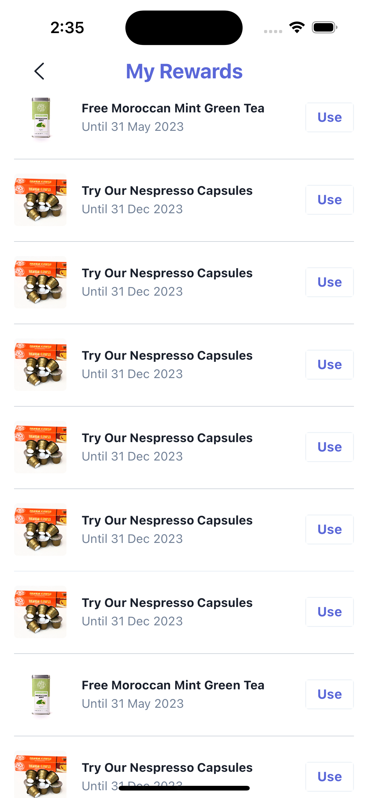
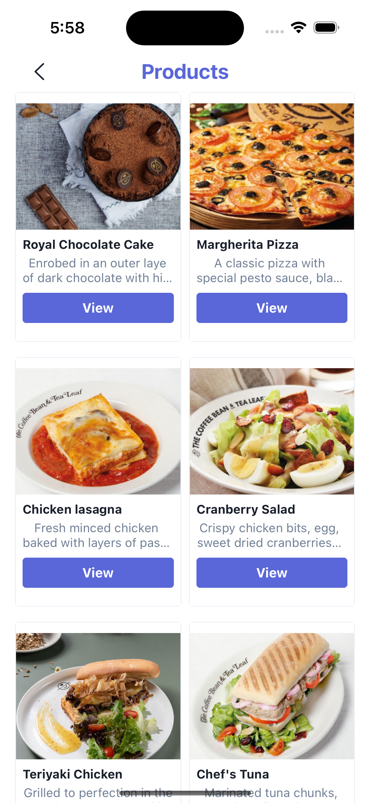
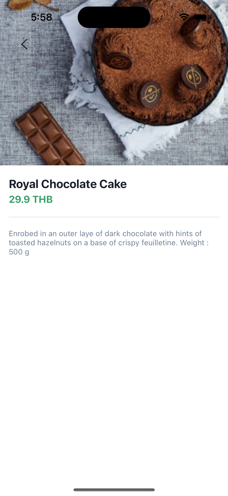

This NimbleLoyalty SDK library allows developers to easily integrate loyalty programs into their iOS applications.

- [Features](#features)
- [Component Libraries](#component-libraries)
- [Requirements](#requirements)
- [Installation](#installation)
- [Usage](#usage)
- [Credits](#credits)
- [License](#license)

## Features

- Authenticate
- Get reward list
- Get reward detail
- Redeem reward
- Get reward history
- Get product list
- Get product detail

## Component Libraries

- Moya
- KeychainAccess

## Requirements

- iOS 14.0+
- Xcode 14.0+

## Installation

The iOS Loyalty SDK can be installed using CocoaPods or Swift Package Manager.

### CocoaPods

To install using CocoaPods, add the following line to your Podfile:

```
pod 'NimbleLoyalty', '~> 0.1.0'
```

### Swift Package Manager

To install using Swift Package Manager, add the following line to your dependencies:

```swift
.package(url: "https://github.com/nimblehq/business-loyalty-ios-sdk-poc.git", from: "0.1.0")
```

## Usage

#### Authentication

Before authenticating the user, remember to set the **clientId** and **clientSecret**.

```swift
NimbleLoyalty.shared.setClientId("CLIENT_ID")
NimbleLoyalty.shared.setClientSecret("CLIENT_SECRET")
```

##### isAuthenticated()

Checks if the user is authenticated.

```swift
if NimbleLoyalty.shared.isAuthenticated() {
    // The user is authenticated, do something
} else {
    // The user is not authenticated, show a login button
}
```

##### authenticate(completion:)

Initiates the authentication flow.

```swift
NimbleLoyalty.shared.authenticate { result in
    switch result {
    case .success:
        // The user is authenticated, do something
    case .failure(let error):
    	print("Error authenticating: \(error.localizedDescription)")
    }
}
```

##### clearSession()

Remove the session, effectively logging the user out.

```swift
// Clear the user's session
NimbleLoyalty.shared.clearSession()
```

#### Get Reward List

Retrieves the list of available rewards for the authenticated user.

```swift
NimbleLoyalty.shared.getRewardList { result in
   switch result {
   case .success(let rewardList):
       // Display the list of rewards to the user
       for reward in rewardList.rewards {
           print("Reward name: \(reward.name)")
       }
   case .failure(let error):
       print("Error retrieving rewards: \(error.localizedDescription)")
   }
}
```

#### Get Reward Detail

Retrieves the detail of a specific reward.

```swift
NimbleLoyalty.shared.getRewardDetail(code: "reward_id") { result in
   switch result {
   case .success(let rewardDetail):
       // Display the reward detail to the user
   case .failure(let error):
       print("Error retrieving reward detail: \(error.localizedDescription)")
   }
}
```

#### Redeem a Reward

Redeems a reward with the given reward's code for the authenticated user.

```swift
NimbleLoyalty.shared.redeemReward(code: "ABC123") { result in
   switch result {
   case .success(let rewardList):
       print("Reward redeemed with ID: \(redeemReward.id)")
   case .failure(let error):
       print("Error redeeming reward: \(error.localizedDescription)")
   }
}
```

#### Get Reward History

Retrieves the reward history for the authenticated user.

```swift
NimbleLoyalty.shared.getRewardHistory { result in
   switch result {
   case .success(let rewardHistory):
       // Display the reward history to the user
       for reward in rewardHistory {
           print("Reward name: \(reward.name)")
       }
   case .failure(let error):
       print("Error retrieving reward history: \(error.localizedDescription)")
   }
}
```

#### Get Product List

Retrieves the list of available products for the authenticated user.

```swift
NimbleLoyalty.shared.getProductList { result in
   switch result {
   case .success(let products):
       // Display the list of products to the user
       for product in products {
           print("Product name: \(product.name)")
       }
   case .failure(let error):
       print("Error retrieving products: \(error.localizedDescription)")
   }
}
```

#### Get Product Detail

Retrieves the detail of a specific product.

```swift
NimbleLoyalty.shared.getProductDetail(id: "product_id") { result in
   switch result {
   case .success(let productDetail):
       // Display the reward detail to the user
   case .failure(let error):
       print("Error retrieving reward detail: \(error.localizedDescription)")
   }
}
```

#### Get Order List

Retrieves the list of orders.

```swift
NimbleLoyalty.shared.getOrderList { result in
   switch result {
   case .success(let orders):
       // Display the list of orders to the user
       for order in orders {
           print("Order id: \(order.id)")
       }
   case .failure(let error):
       print("Error retrieving order list: \(error.localizedDescription)")
   }
}
```

#### Get Order Details

Retrieves the order details.

```swift
NimbleLoyalty.shared.getOrderDetails(orderId: "order_id") { result in
   switch result {
   case .success(let orderDetails):
       // Display the order details to the user
   case .failure(let error):
       print("Error retrieving order details: \(error.localizedDescription)")
   }
}
```

#### Submit order

Submits the order.

```swift
NimbleLoyalty.shared.submitOrder(cartId: "cart_id") { result in
   switch result {
   case .success(let orderDetails):
       // Display the order details to the user
   case .failure(let error):
       print("Error submiting order: \(error.localizedDescription)")
   }
}
```

## Samples

1. Navigate to the Example folder.
2. Fill environment values in .env.example and rename it to .env
3. Run `bundle install`
4. Run `bundle exec arkana`
5. Run `bundle exec pod install`.
6. Open Example.xcworkspace.
7. Build and run the project.

------------

| Example                                                      |                                                              |
| :----------------------------------------------------------- | ------------------------------------------------------------ |
| <br><br> Home screen that demonstrate features from SDK <br><br>• Sign-in<br>• Reward List<br>• Reward History<br><br><br> |            |
|                                                              |                                                              |
| <br><br> Reward List screen that show reward information. <br><br> • Image<br>• Title & description<br>• Expiration<br>• Reward redemption<br><br><br> |  |
|                                                              |                                                              |
| <br><br> Reward Details screen that show reward information. <br><br> • Image<br>• Title & description<br>• Expiration<br>• Reward redemption<br>• Terms<br><br><br> |  |
|                                                              |                                                              |
| <br><br> Reward History screen that show redeemed reward information. <br><br> • Image<br>• Title<br>• Expiration<br><br><br> |  |
|                                                              |                                                              |
| <br><br> Product List screen that show product information. <br><br> • Image<br>• Title & description<br><br><br> |  |
|                                                              |                                                              |
| <br><br> Product Details screen that shows product information. <br><br> • Image<br>• Title & description<br><br><br> |  |

## Credits

<picture>
    <source media="(prefers-color-scheme: dark)" srcset="https://assets.nimblehq.co/logo/dark/logo-dark-text-160.png">
    
  </picture>

This project is maintained and funded by Nimble.

## License

This project is Copyright (c) 2023 and onwards Nimble. It is free software and may be redistributed under the terms specified in the [LICENSE] file.

[LICENSE]: /LICENSE
